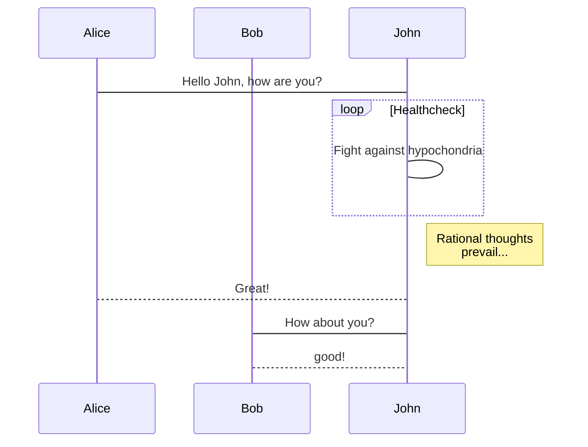

# Markdown画图

## graph（流程图）

注意：  

- 节点名不能与关键字同名  
- 使用引号可以避免与关键字同名  

1. 图的方向
`T = TOP, B = BOTTOM, L = LEFT, R = RIGHT, D = DOWN`  
    - TB, 从上到下  
    - TD，从上到下
    - BT, 从下到上
    - RL, 从右到左
    - LR, 从左到右

    ```mermaid {code_block=true}
    graph LR;
    A-->B
    B-->C
    C-->D
    D-->A
    ```

    ```mermaid
    graph LR;
    A-->B
    B-->C
    C-->D
    D-->A
    ```

2. 节点的形状
    - 默认节点 A
    - 文本节点 B[bname]
    - 圆角节点 C(cname)
    - 圆形节点 D((dname))  
    - 非对称节点 E>ename]  
    - 菱形节点 F{fname}

    ```mermaid{code_block=true}
    graph TB
    A
    B[bname]
    C(cname)
    D((dname))
    E>ename]
    F{fname}
    ```

    ```mermaid
    graph TB
    A
    B[bname]
    C(cname)
    D((dname))
    E>ename]
    F{fname}
    ```

3. 连线  
    节点中的连线有很多种形状，可以在连接线中加入标签：
    - 箭头连接 A1-->B1
    - 开放连接 A2---B2
    - 标签连接 A3--text---B3
    - 箭头标签连接 A4--text-->B4
    - 虚线开放连接 A5---B5
    - 虚线箭头连接 A6-.->B6
    - 标签虚线连接 A7-.text.-B7
    - 标签虚线箭头连接 A8-.text.->B8
    - 粗线开放连接 A9===B9
    - 粗线箭头连接 A10==>B10
    - 标签粗线开放连接 A11\=\=text===B11
    - 标签粗线箭头连接 A12\=\=text==>B12

    ```mermaid{code_block=true}
    graph TB
    A1-->B1
    A2---B2
    A3--text---B3
    A4--text-->B4
    A5---B5
    A6-.->B6
    A7-.text.-B7
    A8-.text.->B8
    A9===B9
    A10==>B10
    A11==text===B11
    A12==text==>B12
    ```

    ```mermaid
    graph TB
    A1-->B1
    A2---B2
    A3--text---B3
    A4--text-->B4
    A5---B5
    A6-.->B6
    A7-.text.-B7
    A8-.text.->B8
    A9===B9
    A10==>B10
    A11==text===B11
    A12==text==>B12
    ```

4. 综合示例：

    ```mermaid {code_block=true}
     graph LR
     start(input x)-->handler(x>0?)
     handler --yes--> yes("output x")
     handler --no--> start
     yes --> exit("exit")
     ```

    ```mermaid
     graph LR
     start(input x)-->handler(x>0?)
     handler --yes--> yes("output x")
     handler --no--> start
     yes --> exit("exit")
     ```

5. subgraph(子图)

    格式：
    >graph LR
      subgraph title1  
        graph defintion  
      end  
      subgraph title2  
          graph defintion  
      end
     ...

    ```mermaid{code_block=true}
    graph LR
      subgraph g1
        a1-->b1
     end
     subgraph g2
        a2-->b2
     end
     subgraph g3
       a3-->b3
     end
     a3-->a2
   ```

    ```mermaid
    graph LR
      subgraph g1
        a1-->b1
     end
     subgraph g2
        a2-->b2
     end
     subgraph g3
       a3-->b3
     end
     a3-->a2
   ```

## Sequence diagram(序列图)

1. 关键字  

    - participant，参与者，相当先定义模块，可通过设定参与者(participant)的顺序控制展示顺序
    - note，便签，格式如下  
        note [right of|left of][Actor]:Text  
    给多个模块做标签，通过逗号分割  
    note over[Actor1, Actor2...]:Text  
    - 循环
    loop loop_text  
    ...statement...  
    end  
    - 选择  
    alt Describing_text  
    ...statement...  
    else  
    ...statement...  
    end  
    推荐在没有else的情况下使用opt(option,选择)  
    opt Describing_text  
    ...statement...  
    end  
2. 连线

    - 无箭头实线 ->
    - 有箭头实线 ->>
    - 无箭头虚线 -->
    - 有箭头虚线 –->>
    - 带x实线 -x
    - 带x虚线 --x

3. 方位控制

    - left of，表示当前对象的左侧
    - right of，表示当前对象的右侧
    - over，表示覆盖在当前对象（们）的上面

4. 实例：

    ```mermaid{code_block=true}
    sequenceDiagram
      Alice->>Bob: Hello Bob, how are you?
      alt is sick
        Bob->>Alice:not so good
      else is well
    　  Bob->>Alice:good
      end
      opt Extra response
    　  Bob->>Alice:Thanks for asking
    　end
    ```

    ```mermaid
    sequenceDiagram
      Alice->>Bob: Hello Bob, how are you?
      alt is sick
        Bob->>Alice:not so good
      else is well
    　  Bob->>Alice:good
      end
      opt Extra response
    　  Bob->>Alice:Thanks for asking
    　end
    ```

  ```mermaid{code_block=true}
   sequenceDiagram
    Note right of A: 倒霉, 碰到B了
    A->B:   Hello B, how are you ?
    note left of B: 倒霉,碰到A了
    B-->A:  Fine, thx, and you?
    note over A,B: 快点溜，太麻烦了
    A->>B:  I'm fine too.
    note left of B: 快点打发了A
    B-->>A: Great!
    note right of A: 溜之大吉
    A-xB:   Wait a moment
    loop Look B every minute
  　  A->>B: look B, go?
  　　B->>A: let me go?
  　end
  　B--xA: I'm off, byte 　
    note right of A: 太好了, 他走了
  ```

  ```mermaid
   sequenceDiagram
    Note right of A: 倒霉, 碰到B了
    A->B:   Hello B, how are you ?
    note left of B: 倒霉,碰到A了
    B-->A:  Fine, thx, and you?
    note over A,B: 快点溜，太麻烦了
    A->>B:  I'm fine too.
    note left of B: 快点打发了A
    B-->>A: Great!
    note right of A: 溜之大吉
    A-xB:   Wait a moment
    loop Look B every minute
  　  A->>B: look B, go?
  　　B->>A: let me go?
  　end
  　B--xA: I'm off, byte 　
    note right of A: 太好了, 他走了
  ```

  通过participant改变A、B的顺序：

  ```mermaid{code_block=true}
  sequenceDiagram
  participant B
  participant A
    Note right of A: 倒霉, 碰到B了
    A->B:   Hello B, how are you ?
    note left of B: 倒霉,碰到A了
    B-->A:  Fine, thx, and you?
    note over A,B: 快点溜，太麻烦了
    A->>B:  I'm fine too.
    note left of B: 快点打发了A
    B-->>A: Great!
    note right of A: 溜之大吉
    A-xB:   Wait a moment
    loop Look B every minute
  　  A->>B: look B, go?
  　　B->>A: let me go?
  　end
  　B--xA: I'm off, byte 　
    note right of A: 太好了, 他走了
  ```

  ```mermaid
  sequenceDiagram
  participant B
  participant A
    Note right of A: 倒霉, 碰到B了
    A->B:   Hello B, how are you ?
    note left of B: 倒霉,碰到A了
    B-->A:  Fine, thx, and you?
    note over A,B: 快点溜，太麻烦了
    A->>B:  I'm fine too.
    note left of B: 快点打发了A
    B-->>A: Great!
    note right of A: 溜之大吉
    A-xB:   Wait a moment
    loop Look B every minute
  　  A->>B: look B, go?
  　　B->>A: let me go?
  　end
  　B--xA: I'm off, byte 　
    note right of A: 太好了, 他走了
  ```




## Flow(流程图)

1. 关键字

    - start/end，表示程序的开始与结束
    - operation，表示程序的处理块
    - subroutine，表示子程序块
    - condition，表示程序的条件判断
    - inputoutput，表示程序的出入输出
    - right/left，表示当前连线在当前模块上的起点(默认从下端开始)
    - yes/no， 表示condition判断的分支(可以和right，left同时使用)

2. 模块定义(模块标识与模块名称可以任意定义名称，但是不能为关键词)：
    模块标识(相当于变量名)=>模块关键词: 模块名称(模块中显示的文字)

3. 连接定义如下:
    模块标识1->模块标识2
    模块标识1->模块标识2->模块标识3
    ...

4. 实例：

```flow{code_block=true}
  st=>start: 开始
  e=>end: 结束
  op=>operation: 输入x
  sub=>subroutine: 是否重新输入
  cond1=>condition: x>0?
  cond2=>condition: yes/no
  io=>inputoutput: 输出x  

  st->op->cond1
  cond1(yes)->io(right)->e
  cond1(no)->sub(right)->cond2()
  cond2(yes, right)->op
  cond2(no)->e
  ```

```flow
  st=>start: 开始
  e=>end: 结束
  op=>operation: 输入x
  sub=>subroutine: 是否重新输入
  cond1=>condition: x>0?
  cond2=>condition: yes/no
  io=>inputoutput: 输出x  

  st->op->cond1
  cond1(yes)->io(right)->e
  cond1(no)->sub(right)->cond2()
  cond2(yes, right)->op
  cond2(no)->e
  ```
